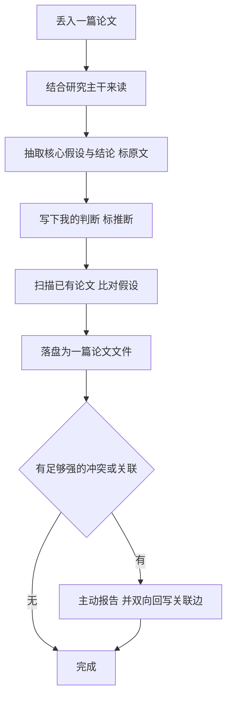

# Jiesheng

给科研用的研究记忆层 Agent 技能。你读过的论文、下过的判断、发现的矛盾，沉淀成带出处、可累积的记忆。

常见的「LLM + 文档」是 RAG：每次查询临时检索、用完即弃，知识不沉淀。结绳相反，它把每篇读过的论文存成结构化、可互链、可回原文核对的记忆文件；当新论文和你过去的结论冲突时，它会主动提醒，而不必等你来问。

技能可在腾讯 QClaw 与 OpenClaw 上运行，当前为 MVP。

---

## 它解决什么

科研要读大量论文，但常常读完就忘：上周读的和这周读的对不上，判断散落各处，要用时找不回来。缺的不是更强的总结工具，而是一个跨时间、跨文献的研究记忆层。

结绳只做两件事：

1. 持久研究记忆。每篇论文存成一个结构化笔记，含核心假设、关键结论、我的判断、关联，一篇一个文件，越读越多。
2. 主动关联提示。新论文与已有结论产生关系，比如冲突、互补、取代、可组合时，主动提示，不必等你问。

底线是溯源。核心假设和结论必须标 `[原文 §x]`、可回原文核对；自己的判断标 `[推断]`。客观事实与主观判断在字段层面就分开，这是科研里能信任记忆的前提。

它带来的是：记得你的研究脉络，主动指出新旧文献的冲突，把你的判断留住、写 related work 时随手调出，并能顺着你的卡点去检索新文献。

---

## 快速开始

前置：一个 QClaw 或 OpenClaw 运行环境。PDF 抽取需要 `pip install pypdf`。

安装，QClaw 与 OpenClaw 技能格式相同：

```bash
# 从 GitHub 安装进 QClaw
qclaw skill install github:wuzhongyun648/jiesheng

# 或本地导入：把整个 jiesheng/ 放进技能搜索路径
#   QClaw:    C:\Users\<用户名>\.qclaw\skills\jiesheng\
#   OpenClaw: ~/.openclaw/workspace/skills/jiesheng/
```

使用：在 QClaw 里丢进一篇论文 PDF，说「用结绳读一下这篇，能不能用」。Agent 会按 SOP 读它，抽出带出处的结构化笔记，扫描已有论文，发现冲突时主动提醒，并把笔记和关联边落盘。

记忆存放：默认写到用户数据目录 `~/.jiesheng/workspace`，与技能代码分开，重装或更新技能不会丢记忆。可用环境变量 `JIESHENG_WORKSPACE` 或脚本参数 `--workspace` 覆盖。仓库里的 `workspace/` 是开发和演示用的种子记忆。

---

## 它怎么工作

技能由 `SKILL.md`（自然语言 SOP）和一组 Python 脚本组成，分工明确：

- Agent 负责语义：读论文、抽假设、下判断、判断冲突，由 SKILL.md 的 SOP 引导。
- 脚本只做机械 I/O：解析 PDF、按 schema 读写 markdown、维护关联边。脚本不调大模型、不带 API key、纯本地、用 pathlib 跨平台，因此能通过 QClaw 的安全扫描。

记忆以 markdown 文件为唯一真相源：

- `MEMORY.md` 是研究主干，含课题、方法、卡点，每轮加载、保持精简。
- `memory/papers/{id}.md` 一篇论文一个文件。

读一篇论文的工作流，其中比对冲突和回写关联是不可跳过的步骤：



一篇论文记忆文件的样子，注意 `[原文 §x]` 与 `[推断]` 的字段级区分，以及带类型的关联边：

```
# Improved Algorithms for Linear Stochastic Bandits

**出处**: Abbasi-Yadkori, Pál & Szepesvári · NeurIPS 2011

## 核心假设
- reward 平稳：θ* 固定，期望 reward 为线性 E[r]=⟨x,θ*⟩ [原文 §1]

## 关键结论
- 自归一化的置信椭球构造不依赖平稳性假设 [原文 §4]

## 我的判断
- regret 界依赖 θ* 固定，不适用我的非平稳设定；但 confidence set 的构造那段或可借到演化图 [推断]

## 关联
- ⟷ `ppr-dynamic-2016` （冲突：平稳 vs 非平稳）
```

---

## 仓库结构

```
jiesheng/
├── README.md                  # 本文件
├── CLAUDE.md                  # @SKILL.md 自动加载入口，OpenClaw / Claude Code
├── SKILL.md                   # 自然语言 SOP：读一篇论文 / 写 related work / 顺脉络找下一步
├── scripts/
│   ├── _paths.py              # workspace 路径解析：--workspace > JIESHENG_WORKSPACE > ~/.jiesheng/workspace
│   ├── _md.py                 # 共享的 markdown 读取与分节 helper，被 list_papers / link_papers 复用
│   ├── extract_pdf.py         # PDF 转文本，pypdf 等后端，缺失时友好提示
│   ├── write_paper.py         # 结构化字段写入 memory/papers/{id}.md，字段级 [原文]/[推断] 校验
│   ├── list_papers.py         # 扫描已有论文摘要供 Agent 比对，从 markdown 读，非索引
│   ├── link_papers.py         # 双向回写关联边，幂等，无向对称、有向视角正确
│   ├── save_related_work.py   # 生成带出处的 related work 草稿
│   └── add_to_reading_list.py # 待读清单写入，按 arXiv id 去重、幂等
└── workspace/                 # 模板记忆（安装后替换成你自己的；生产默认写 ~/.jiesheng/workspace）
    ├── MEMORY.md              # 研究主干模板
    └── memory/papers/         # 论文笔记目录（初始为空，逐篇沉淀）
```

---

## 设计取舍

- markdown 为唯一真相源，暂不上向量库或知识图谱。几十到上百篇的量级，文件加全量加载或关键词检索召回足够、成本极低，也让记忆始终可读、可审计。规模真撑不住时只换检索后端，比如向量库、Mem0、MemoryOS，论文 schema 不变。这是可延迟、可逆的决定，详见 `docs/选型对照.md`。
- 溯源是字段级硬约束。`[原文 §x]` 和 `[推断]` 必须分开，缺标签直接拒写。科研里最该避免的错误，是把论文没说的当成论文说的。
- 冲突检测和双向关联回写写死在流程里，不靠模型临场发挥，也不靠用户自律，这样主动连点才会稳定发生。
- 记忆与技能代码分开。记忆是用户数据，技能是可复用代码，生命周期不同；记忆放在独立用户目录，重装或更新技能不会触碰。
- Agent 做语义，脚本做机械活，纯本地无 key。既符合 OpenClaw 的 CLI 优先取向，也让技能能过 QClaw 安全扫描、不外泄数据。

---

## 它和 LLM Wiki 及现有工具的关系

结绳的核心模式和 Andrej Karpathy 的 [LLM Wiki](https://github.com/karpathy/442a6bf555914893e9891c11519de94f) 一致：用 markdown 而非 RAG、schema 驱动、标记矛盾。这是独立设计后才发现的。在通用模式之上，结绳为科研场景补了三点：字段级强制溯源、带类型的双向冲突与关联边、封装成可部署进 QClaw 的技能。

- 对比 NotebookLM、ChatGPT、Zotero+GPT：它们按次使用、面向个人、无溯源、不报冲突；结绳累积、可溯源、主动连点。
- 对比通用 RAG：RAG 每次重新检索；结绳维护一份会累积的知识。
- 对比 Mem0、MemoryOS：那是对话记忆，记住用户；结绳是带溯源和冲突关系的研究知识，记住论文。

---

## 路线图

- [x] B0 到 B3：脚手架与种子、读论文闭环、主动连点（冲突检测加双向回写）、检索与复用（related work 加顺脉络找下一步）。
- [x] 记忆与技能解耦、纯本地、跨平台。
- [ ] 多用户、权限、审计，面向团队的组织级研究记忆。
- [ ] 规模上来后接入向量检索后端，schema 不变。
- [ ] 垂直场景模板，如药物警戒文献监测，监管强制、强溯源、数据不出域。

---

## 深入阅读

- `docs/选型对照.md`：markdown、Mem0、MemoryOS 的选型分析与切换路径。
- `docs/商业化框架.md`：从个人工具到组织级研究记忆层的产品与商业化思考。

---

## 致谢与参考

- Andrej Karpathy 的 LLM Wiki 模式；OpenClaw 与 QClaw 的技能框架。
- 参考的记忆框架：Mem0，arXiv:2504.19413；MemoryOS，arXiv:2506.06326。

---

> 本项目最初是腾讯产品经理实训营的作业，后续持续落地为可运行的 MVP。
